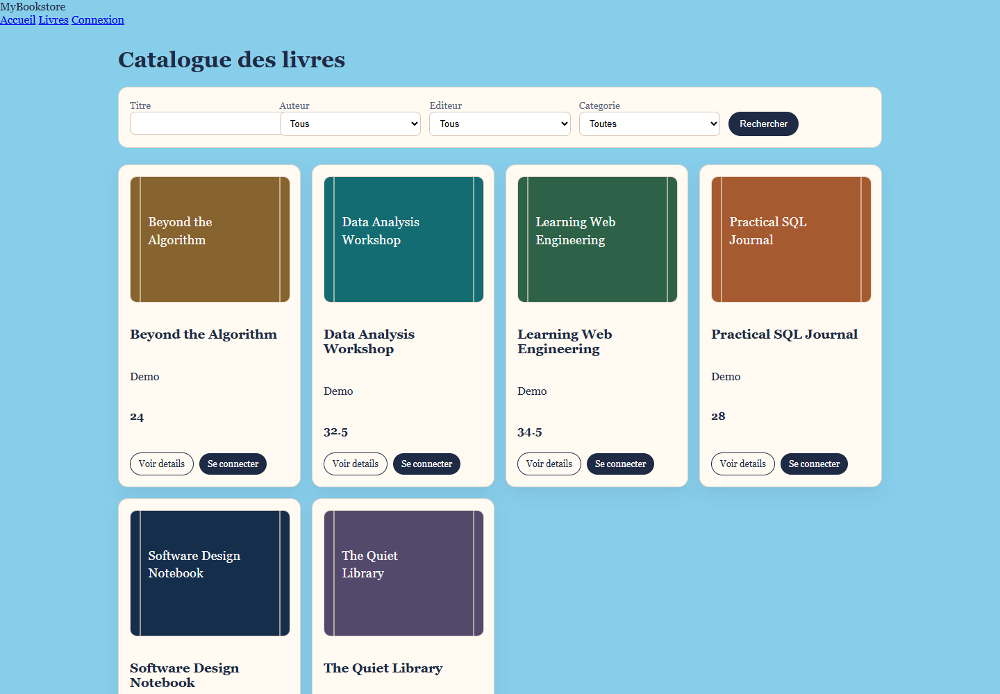
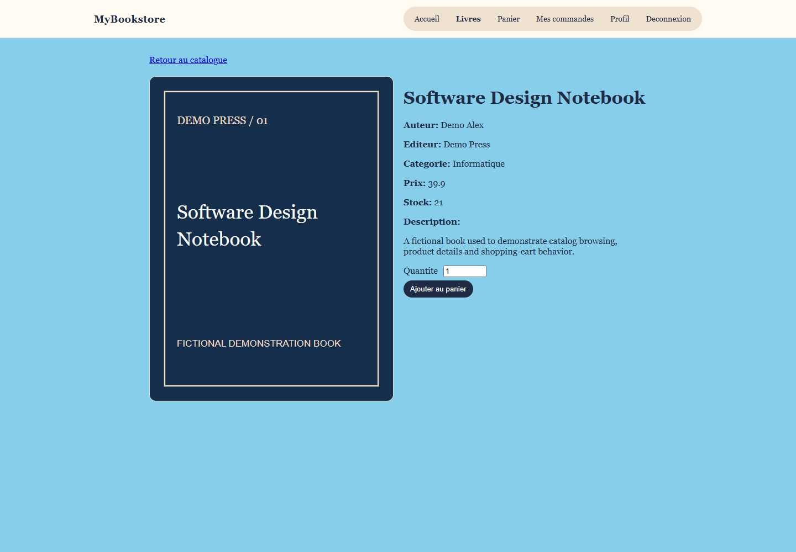
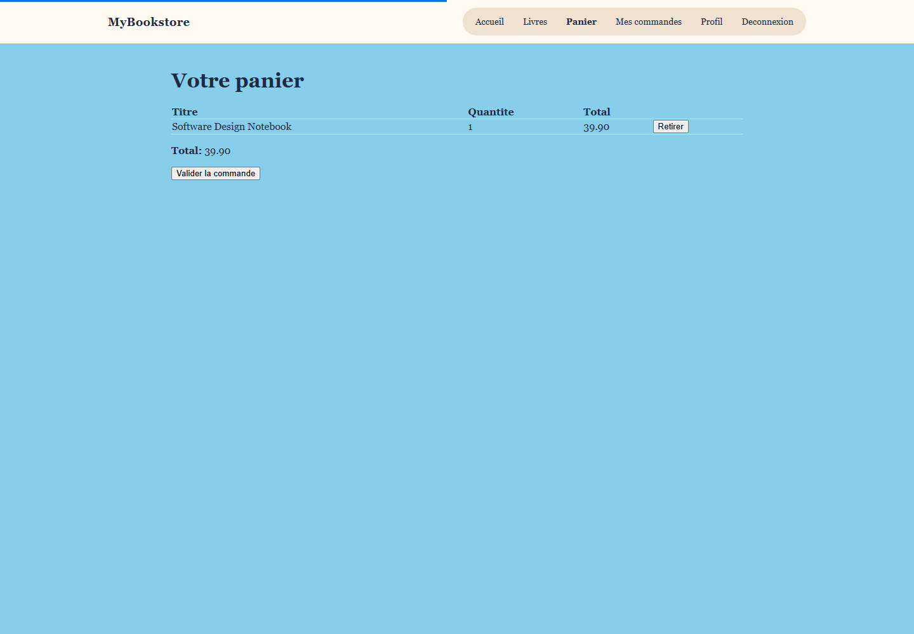

# Online Bookstore — Symfony

[](https://github.com/KhaledZouari/online-bookstore-symfony/actions/workflows/ci.yml)
[](LICENSE)

A full-stack bookstore application with a product catalog, shopping cart,
ordering workflow, user accounts, and an administration area.

## Features

- Book catalog with authors, publishers, categories, and search
- Session-based cart management
- Customer accounts and order history
- Checkout and order lifecycle management
- EasyAdmin back office for catalog and order administration

## Stack

PHP, Symfony, Doctrine ORM, Twig, EasyAdmin, Bootstrap, and PHPUnit.

## Architecture

The application follows Symfony's controller–service–repository structure.
Doctrine entities model books, authors, publishers, categories, users, orders,
and order lines.

## Local setup

Prerequisites: PHP 8.2+, Composer, and a Doctrine-compatible database.

```bash
git clone https://github.com/KhaledZouari/online-bookstore-symfony.git
cd online-bookstore-symfony
composer install
php bin/console doctrine:database:create
php bin/console doctrine:migrations:migrate
symfony server:start
```

Set `DATABASE_URL` in `.env.local`; never commit credentials.

## Tests

```bash
php bin/phpunit
```

## Business context and engineering approach

### Bookstore ordering workflows

The bookstore connects book discovery, a session-based shopping cart and order
management. Symfony controllers and services coordinate the customer workflow;
Doctrine maps catalog and order entities; EasyAdmin provides a separate
management interface.

Cart state is separated into a service, ORM repositories support catalog access
and Twig templates render customer-facing pages. Administration uses Symfony
authorization rather than relying solely on hidden navigation links.

## Application screenshots

Captured from the running application on 3 October 2026.

### Book catalog



Books, categories and prices from the isolated demonstration database.

### Book details



A product page with bibliographic information and an add-to-cart workflow.

### Shopping cart



Session-based quantities and calculated order totals.

### Capture environment

The local run uses PHP 8.4, installed Composer dependencies and an isolated
SQLite schema generated from the Doctrine mappings. Six fictional books and a
local subscriber account exercise catalog browsing, login and the cart. Book
covers are simple demonstration assets. The development profiler is disabled for
the screenshots. The checked-in migration targets MySQL and was not executed
against SQLite.

## Evidence and current scope

The capture database contains only fictional books and local demonstration
records. These screens do not establish payment-provider integration or
production readiness.

## License

Distributed under the MIT License. See [LICENSE](LICENSE).
